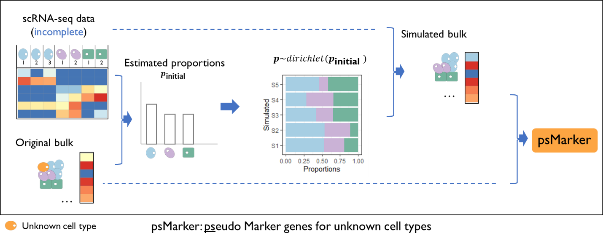

```{r setup, include=FALSE}
knitr::opts_chunk$set(
  echo = FALSE,
  message = FALSE,
  warning = FALSE,
  results = 'asis'   # ensures HTML tables and ggplots render
)
```


```{r Load Pacakges, include=TRUE}
# Load necessary libraries
library(MiCBuS)
library(dplyr)
library(ggplot2)
library(ggVennDiagram)
library(knitr)
```


Marker Gene Mining for Unknown Cell Types Using Bulk and Single Cell RNA-Seq Data

```{r fig1, echo=FALSE, out.width="90%", fig.align='center'}

```


A framework of MiCBuS to identify marker genes for unknown cell types. The unknown cell types, highlighted in orange, are present in bulk RNA-seq data but remain undetected in incomplete scRNA-seq data. MiCBuS takes both bulk and single-cell RNA-seq data as input and follows three major steps. MiCBuS estimates cell type proportions in bulk RNA-seq data using scRNA-seq as a reference. It then proceeds to generate Dirichlet-pseudo-bulk RNA-seq samples. By comparing these simulated Dirichlet-pseudo-bulk RNA-seq samples with the original bulk RNA-seq data, MiCBuS can identify pseudo marker genes of unknown cell types, referred to as psMarker.  

This is an example of how to use **MiCBuS**.

```{r Load Data, include=TRUE, echo=TRUE}
# load bulk RNA-seq data (raw count table)
bulkdat <- read.csv(
  system.file("extdata", "bulkDat.csv", package = "MiCBuS"),
  row.names = 1
)
bulkdat <- as.matrix(bulkdat)

# load cell type RNA-seq data (sc or bulk)
sc_eset_incomplete <- readRDS(
  system.file("extdata", "sc_eset_incomplete.rds", package = "MiCBuS")
  )
```


```{r MiCBuS, include=TRUE, echo=TRUE}
# Run MiCBuS() function to get the DE table for pseudo marker gene for unknown cell types.
DEpseudo.df <- MiCBuS(bulkdat=bulkdat,sc_eset=sc_eset_incomplete,m=20, seed=1234)
```


To evaluate how well the marker genes for unknown cell types are detected in the psMarker gene set, we use the scMarker genes identified from complete scRNA-seq data. In the performance evaluation, we used the Jaccard index, a commonly used metric to measure how similar two sets of genes are in terms of their shared elements. It is calculated by dividing the size of the intersection of the sets (the number of genes they have in common) by the size of the union of the sets (the total number of unique genes in both sets). The resulting value ranges from 0 to 1, where 0 indicates no overlap, and 1 indicates complete overlap. 

**Table 1. Evaluation of Performance of MiCBuS Using Jaccard Index**

```{r Evaluation, include=TRUE, echo=TRUE}
# Select top pseudo-bulk marker genes from MiCBuS DE results
psMarkerTop <- psMarker_Top(DEpseudo.df = DEpseudo.df, ntop = 200)

# Load marker genes (Top 200 for each cell type) identified from complete scRNA-seq data 
# Only applicable when the gene profile of unknown cell type is given
scMarkersTop <- read.csv(system.file("extdata", "scMarkersTop.csv", package = "MiCBuS"))

# Compare psMarker genes with marker genes identified from complete scRNA-seq data
# Helper: compute intersection count + Jaccard index
calc_jaccard <- function(set1, set2) {
  inter <- length(intersect(set1, set2))
  jac   <- inter / length(union(set1, set2))
  c(n_intersect = inter, jaccard = jac)
}

# Identify the missing cluster(s)
mis <- setdiff(scMarkersTop$cluster, pData(sc_eset_incomplete)$cluster)

# Split marker genes into mis and other(unique)
mis_genes   <- scMarkersTop$gene[scMarkersTop$cluster %in% mis]
other_genes <- setdiff(scMarkersTop$gene[!scMarkersTop$cluster %in% mis], mis_genes)

# Calculate Jaccard for each comparison
res <- rbind(
  Unknown_Cell_Type    = calc_jaccard(psMarkerTop, mis_genes),
  Other_unique   = calc_jaccard(psMarkerTop, other_genes)
)

# Prepare a clean data frame
jaccard_df <- data.frame(
  scMarker = rownames(res),
  Number_of_intersected_genes = res[, "n_intersect"],
  Jaccard_index = round(res[, "jaccard"], 3),
  row.names = NULL
)

# output table
kable(jaccard_df)
```

The comparison of psMarkers and scMarkers can also be shown in this Venn diagram.This figure includes three gene sets, **ps** (psMarker genes of unknown cell types identified by MiCBuS) and scMarker (**mis**: marker genes of the unknown cell types identified using unmasked scRNA-seq data; **other**: marker genes of the other known cell types identified using unmasked scRNA-seq data.) 


```{r Visualization, include=TRUE, echo=TRUE, fig.width=3, fig.height=3, echo=FALSE, message=FALSE, warning=FALSE, fig.align='center'}
# Visualize using Venn Diagram
x <- list(ps=psMarkerTop,
          mis=scMarkersTop[scMarkersTop$cluster==mis,]$gene,
          other=scMarkersTop[!scMarkersTop$cluster %in% mis,]$gene)

vennp <- ggVennDiagram(x, set_size=5, color="black", edge_size=1.2,
                       lty=1, label="count", label_size=5) +
  scale_fill_gradient(low="#F4FAFE", high="#4981BF")
vennp
```

```{r SessionInfo, include=TRUE, echo=TRUE}
sessionInfo()
```


